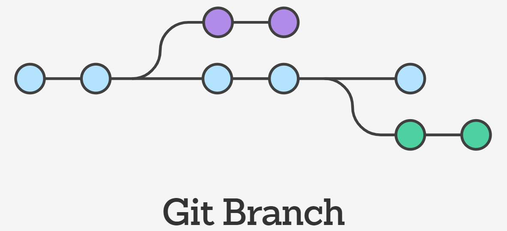

## Branching 

Git branches are effectively a pointer to a snapshot of your changes. When you want to add a new feature or fix a bug—no matter how big or how small—you spawn a new branch to encapsulate your changes. This makes it harder for unstable code to get merged into the main code base, and it gives you the chance to clean up your future's history before merging it into the main branch

*Branches are just pointers to commits, when you create a branch, all Git needs to do is create a new pointer, it doesn’t change the repository in any other way

## Avoid merge conflict 

•Think ahead: Identify as early as possible potential areas of conflict. If you use Scrum, use your planning, refining and stand ups to identify these overlapping areas. If you use any other methodology, whenever you’re planning or thinking what’s coming next for you and your colleagues.

•If problematic merge conflicts are foreseen, evaluate if a different story/task splitting approach avoids them. You may find S.P.I.D.R. helpful in that situation.

•The smaller the tasks & features, the smaller the chances of merge conflicts.

•Merge your feature branches as soon as possible. If they’re done, don’t let them hanging in there. If your team thinks about an enhancement that can be added, merge your current branch if it already adds value and create a new one for that enhancement.
•Sync up feature branches with master frequently.

•Do not branch too deeply. You will be increasing the time to execute each merge and resolve potential conflicts.

## How to create a merge conflict 

•Create a new directory named git-merge-test, change to that directory, and initialize it as a new Git repo.

•Create a new text file merge.txt with some content in it.  

•Add merge.txt to the repo and commit it.

•Now we have a new repo with one branch master and a file merge.txt with content in it.

•create and check out a new branch named new_branch_to_merge_later

•overwrite the content in merge.txt  

•commit the new content

•With this new branch: new_branch_to_merge_later we have created a commit that overrides the content of merge.txt

•This chain of commands checks out the master branch, appends content to merge.txt, and commits it. 

•This now puts our example repo in a state where we have 2 new commits. 

## Resolve a merge conflict

•Competing line change merge conflict, To resolve a merge conflict caused by competing line changes, you must choose which changes to incorporate from the different branches in a new commit.

•Remove file merge conflicts, To resolve a merge conflict caused by competing changes to a file, where a person deletes a file in one branch and another person edits the same file, you must choose whether to delete or keep the removed file in a new commit.

