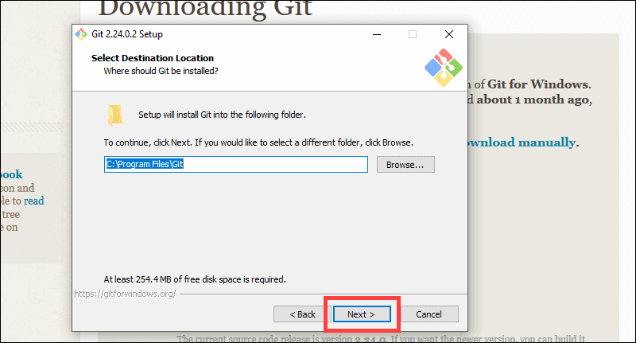
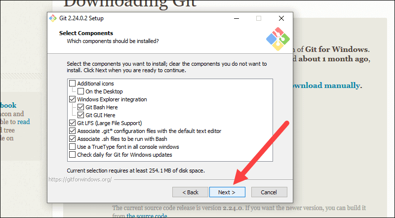
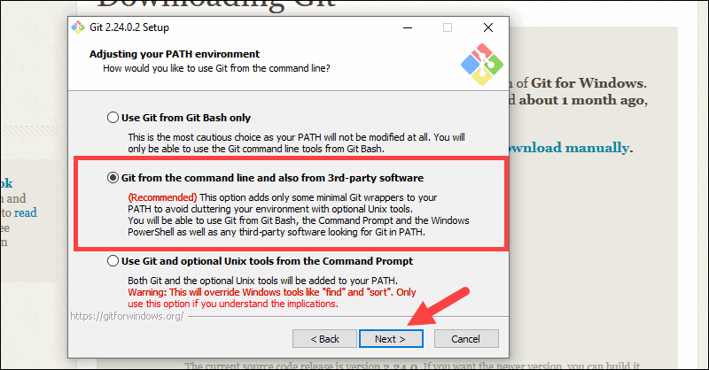
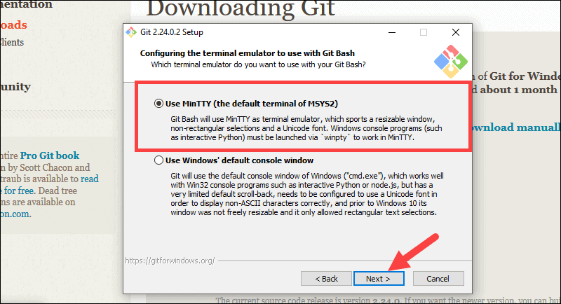
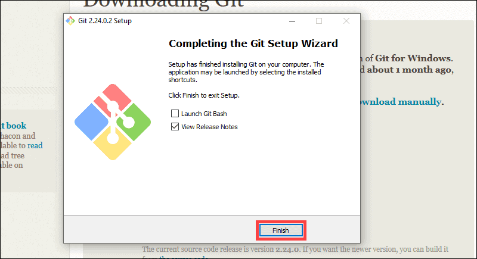

## Install Git for Windows

1.)	Download Git for Windows:
[Git](https://git-scm.com/downloads) - link!

2.)	Browse to the download location,Double-click the file to extract and launch the installer.

3.)	Allow the app to make changes to your device by clicking Yes on the User Account Control dialog that opens.

4.)	Review the GNU General Public License, and when you’re ready to install, click Next

5.)	The installer will ask you for an installation location. Leave the default, unless you have reason to change it, and click Next.

6.)	A component selection screen will appear. Leave the defaults unless you have a specific need to change them and click Next.

7.)	The installer will offer to create a start menu folder. Simply click Next.

8.)	Select a text editor you’d like to use with Git. Use the drop-down menu to select Notepad++ (or whichever text editor you prefer) and click Next.

9.)	This installation step allows you to change the PATH environment. The PATH is the default set of directories included when you run a command from the command line. Leave this on the middle (recommended) selection and click Next.

10.)	Most users should use the default. If you’re working in an Active Directory environment, you may need to switch to Windows Store certificates. Click Next.

11.)	It is recommended that you leave the default selection. This relates to the way data is formatted and changing this option may cause problems. Click Next.

12.)	Choose the terminal emulator you want to use. The default MinTTY is recommended, for its features. Click Next.

13.) Just click next because those are optional choices

14.) Click Finish

