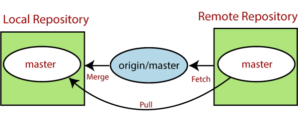

## Pull Request 

•Pull requests let you tell others about changes you've pushed to a branch in a repository on GitHub

•Once a pull request is opened, you can discuss and review the potential changes with collaborators and add follow-up commits before your changes are merged into the base branch.

•After initializing a pull request, you'll see a review page that shows a high-level overview of the changes between your branch  and the repository's base branch.

•You can add a summary of the proposed changes, review the changes made by commits, add labels, milestones, and assignees, and @mention individual contributors or teams.

## Draft Pull request 

•Draft pull requests are available in public repositories with GitHub Free for organizations and legacy per-repository billing plans, and in public and private repositories with GitHub Team, GitHub Enterprise Server 2.17+, and GitHub Enterprise Cloud

•Draft pull requests cannot be merged, and code owners are not automatically requested to review draft pull requests. 

## Difference between commits on compare and pull request 

•Compare pages show the diff between the tip of the head ref and the current common ancestor (that is, the merge base) of the head and base ref. 

•Pull request pages show the diff between the tip of the head ref and the common ancestor of the head and base ref at the time when the pull request was created. Consequently, the merge base used for the comparison might be different.

## Sit

* https://www.atlassian.com/git/tutorials/making-a-pull-request
